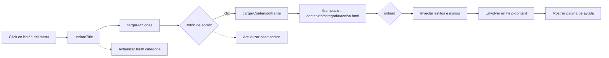
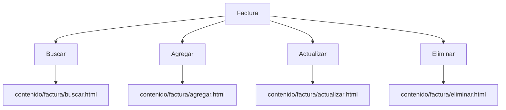
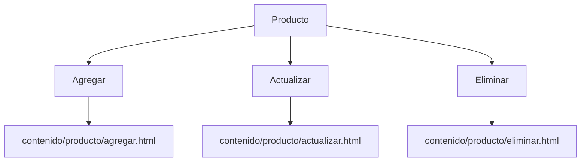
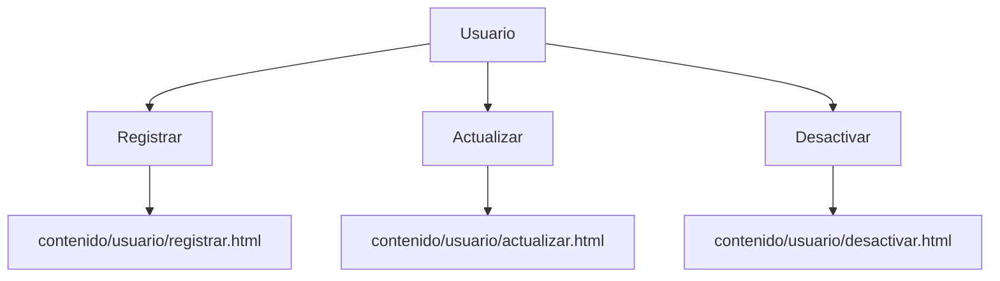
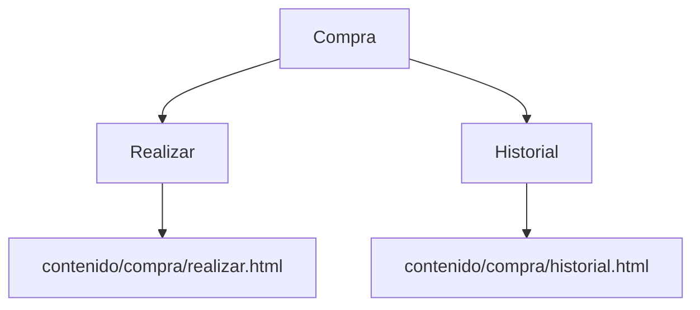
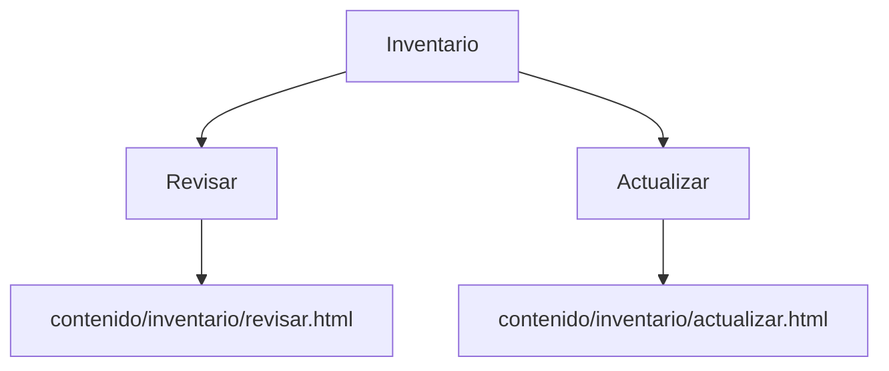
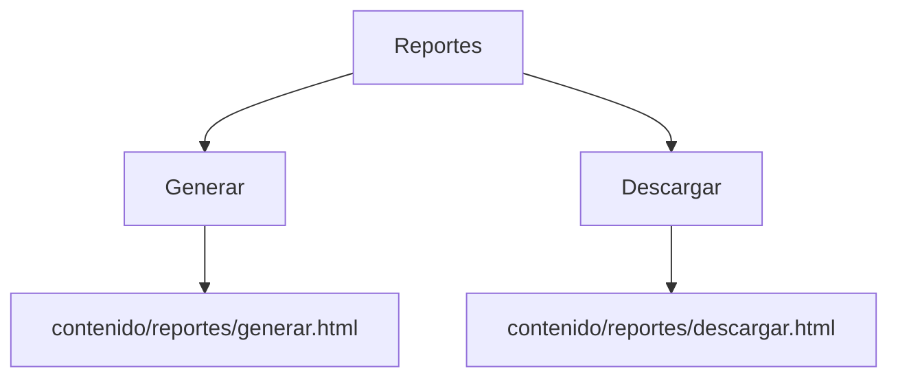
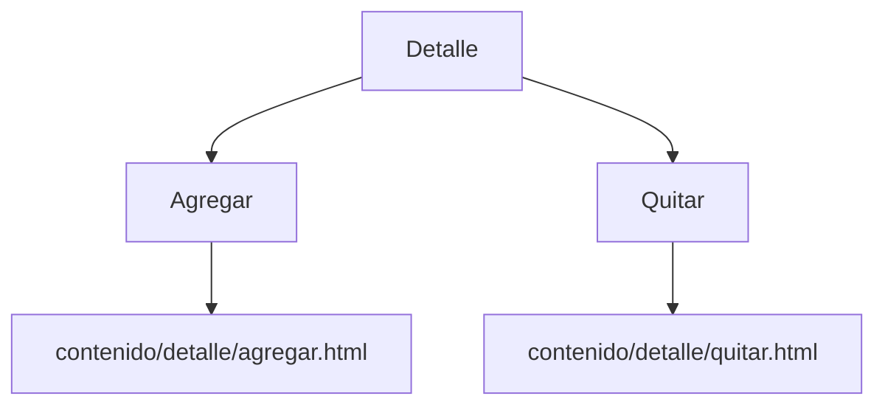

# Sistema de Ayuda (Plantilla docente)

Este proyecto es un ejemplo de “Manual de Usuario” para acompañar un sistema. Está pensado para clases: los estudiantes pueden cambiar textos, colores e imágenes sin tocar la estructura técnica.

## ¿Cómo funciona el flujo?

1) index.html (entrada principal)
- Estructura la página en dos zonas: menú lateral (izquierda) y contenido (derecha).
- El menú tiene botones por categoría (Factura, Producto, Usuario, etc.).
- Al hacer clic, se llama a `updateTitle('Categoría')` que actualiza el título y carga las acciones.

Diagrama del flujo principal (clic → acciones → carga en iframe):



2) js/scripts.js (lógica sencilla)
- Define qué acciones tiene cada categoría (por ejemplo, Factura → Agregar, Actualizar, Buscar, Eliminar).
- Dibuja los botones de acciones y, cuando se hace clic, carga un archivo HTML dentro del iframe.
- Convierte el nombre de la categoría a una carpeta para encontrar el contenido (por ejemplo, "Categoría" → `contenido/categoria/`).
- Inserta dentro del iframe los estilos de ayuda y los iconos para que todo se vea igual.
- Guarda en la URL el estado seleccionado (`#categoria=...&accion=...`) para compartir enlaces.

3) contenido/*/*.html (las páginas del manual)
- Cada archivo es una página de ayuda independiente (por ejemplo, `contenido/factura/buscar.html`).
- Deben tener un bloque `<div class="help-content">...</div>` que es donde se muestra el texto, imágenes y ejemplos.
- Puedes escribir pasos, listas, callouts (avisos) y figuras con pie de imagen.

4) estilos/styles.css (estilo general del sitio)
- Colores y layout del marco principal (menú, encabezados, botones).
- Variables en `:root` para personalizar la paleta con rapidez.

5) estilos/help-styles.css (estilo del contenido del manual)
- Se aplica dentro del iframe a cada página de `contenido/`.
- Incluye tipografía, callouts, y tamaños de imágenes pensados para lectura.

## ¿Qué páginas se conectan entre sí?

- El menú de `index.html` → llama a `updateTitle('Categoría')` → `js/scripts.js` dibuja acciones.
- Botón de acción → carga `contenido/<categoria>/<accion>.html` dentro del iframe.
- Los estilos que afectan al contenido del manual vienen de `estilos/help-styles.css` (se inyecta automáticamente en el iframe).

Relaciones principales (ejemplos):
- Factura → Buscar → `contenido/factura/buscar.html`
- Producto → Actualizar → `contenido/producto/actualizar.html`
- Usuario → Registrar → `contenido/usuario/registrar.html`
- Compra → Realizar → `contenido/compra/realizar.html`
- Inventario → Revisar → `contenido/inventario/revisar.html`
- Categoría → Crear → `contenido/categoria/crear.html`
- Reportes → Generar → `contenido/reportes/generar.html`
- Detalle → Agregar → `contenido/detalle/agregar.html`

Mapa del sitio por categoría (diagramas separados para mejor legibilidad):

Factura


Producto


Usuario


Compra


Inventario


Categoría


Reportes


Detalle


## ¿Para qué sirve este proyecto?

- Servir como guía de ayuda navegable para usuarios.
- Ejercicio docente: que los estudiantes editen textos, agreguen figuras y entiendan la relación entre páginas.

## Generalidades del código (qué cambiar y qué conservar)

- index.html
  - Puedes cambiar textos visibles (títulos, nombres de botones) y el logo.
  - Conserva la estructura del menú: lista `<ul class="nav">` con elementos `<li><button ...>...</button></li>`.

- js/scripts.js
  - Cambia los nombres en `accionesPorCategoria` para añadir o quitar acciones.
  - Conserva las funciones y sus nombres; así la navegación y el iframe siguen funcionando.

- estilos/styles.css
  - Cambia colores desde las variables en `:root`.
  - No cambies `display`, `flex-direction` y alturas del layout a menos que sepas el impacto.

- estilos/help-styles.css
  - Es el lugar para mejorar la lectura del manual: tamaños de texto, callouts, figuras.
  - Aquí también controlas el tamaño de las imágenes del manual (ver sección siguiente).

- contenido/*/*.html
  - Edita los títulos, párrafos y listas.
  - Usa callouts y figuras para hacer más clara la explicación.
  - Mantén el contenedor `.help-content`.

## Imágenes en el manual (tres tamaños recomendados)

Para insertar imágenes con tamaño consistente, usa figuras con clases:

- Pequeño (entre texto):
```html
<figure class="help-figure is-small">
  
  <figcaption>Figura. Texto explicativo corto.</figcaption>
</figure>
```
- Mediano (entre párrafos, tamaño por defecto):
```html
<figure class="help-figure">
  
  <figcaption>Figura. Texto explicativo.</figcaption>
</figure>
```
- Grande (para detalles, ocupa gran parte de la página):
```html
<figure class="help-figure is-xl">
  
  <figcaption>Figura. Texto explicativo con más detalle.</figcaption>
</figure>
```

Equivalencias de ancho (configurable en `estilos/help-styles.css`):
- `is-small` ≈ 280 px
- por defecto ≈ 360 px
- `is-large` ≈ 480 px
- `is-xl` ≈ 720 px

## Callouts (avisos y tips)

Puedes resaltar notas importantes:
```html
<div class="callout callout-info"><i class="bi bi-info-circle"></i> Consejo: usa filtros para acotar la búsqueda.</div>
```
Variantes disponibles: `callout-info`, `callout-success`, `callout-warning`, `callout-danger`.

## Agregar una nueva categoría o acción

1) Agrega el botón en `index.html` (en la lista del menú) llamando a `updateTitle('Nombre')`.
2) En `js/scripts.js`, agrega el nombre en el objeto `accionesPorCategoria`.
3) Crea la carpeta `contenido/<nombre-sin-acentos>/` si no existe.
4) Crea los archivos `contenido/<nombre>/<accion>.html` (uno por acción) con esta estructura mínima:
```html
<!DOCTYPE html>
<html lang="es">
<head>
  <meta charset="UTF-8" />
  <title>Mi Categoría - Mi Acción</title>
  <link rel="stylesheet" href="../../estilos/help-styles.css" />
  <meta name="viewport" content="width=device-width, initial-scale=1.0" />
</head>
<body>
  <div class="help-content">
    <h2>Mi Categoría - Mi Acción</h2>
    <p>Explicación breve...</p>
  </div>
</body>
</html>
```

## Recomendaciones de imágenes

- Usa ilustraciones libres (unDraw, Storyset) o capturas reales del sistema.
- Formato: preferible SVG (ilustraciones) o WebP (capturas) y nombra así: `assets/ilustraciones/tema.svg` o `assets/capturas/categoria-accion-1.webp`.
- Mantén un ancho razonable según el tamaño elegido (small/medium/large/xl) para que el manual sea legible.

## Objetivo docente

- Practicar estructura HTML básica, lectura de CSS y entender una mínima lógica JS.
- Enfocado en personalización segura: cambiar textos, colores e imágenes sin romper la navegación.

¡Éxitos en la práctica! Si algo deja de funcionar, revisa que los nombres de archivos y carpetas coincidan con la categoría y acción que definiste.


